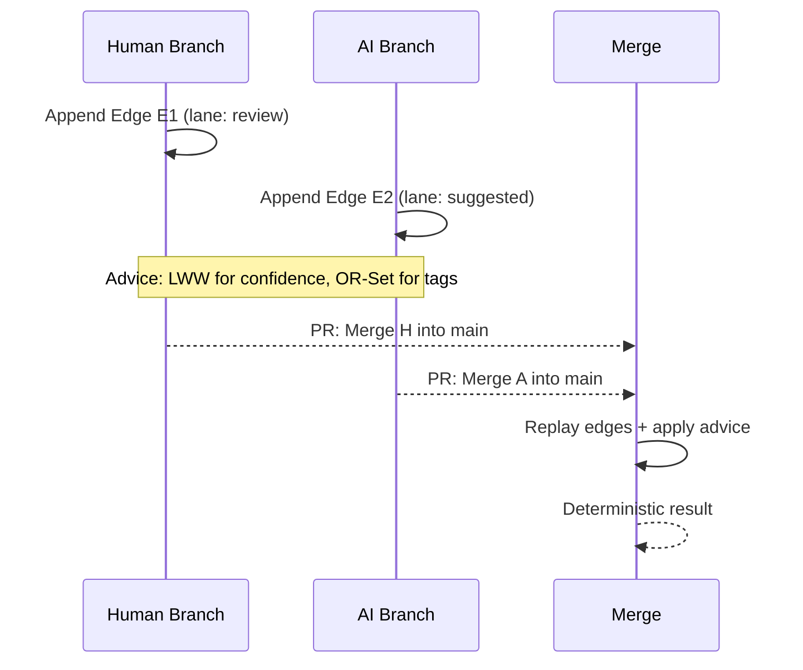

# Deterministic Merges with CRDT Advice

When knowledge lives in Git, merges need to be predictable. We model edges as commits (append‑only) and layer “advice” with a minimal set of CRDT rules: Last‑Writer‑Wins (LWW) for scalars and OR‑Set for collections. Two people (or a person and an AI) can explore semantics on branches and then converge without surprises. No hidden conflict resolvers, no opaque heuristics—just deterministic replay on top of Git’s own merge model.

Practically, this makes collaboration ergonomic. You can park suggestions in a lane (e.g., `suggested`), filter by attribution (human vs. AI), and promote decisions when they’re ready. Disagreements become visible data, and resolution is a function of history—not who clicked “merge” first.

Determinism turns semantics into infrastructure. You can trust your graph to converge the same way across machines, CI, and time.
