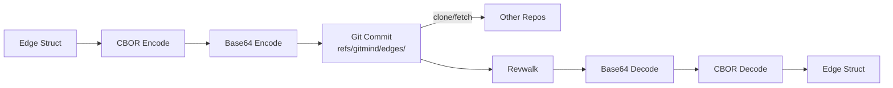

# Journal‑First CBOR Commits: Time‑Travel You Can Trust

Most systems treat metadata as an afterthought; we made it the source of truth. In git‑mind, every semantic edge is an append‑only CBOR payload committed under a dedicated ref (`refs/gitmind/edges/<branch>`). That journal design buys us three things at once: immutability (no in‑place mutation, ever), auditability (every change has authorship, time, and diff), and actual time‑travel (check out an old commit and you get the semantics from that moment). It’s just Git, which means the transport, permission model, replication, and conflict semantics are already battle‑tested.

Why CBOR? It’s compact, typed, and unambiguous—perfect for encoding edges and attribution without dragging in a heavy runtime. We base64 the CBOR for commit messages to keep things ASCII‑safe, and we keep writes strictly append‑only so content merges like code. The journal can be scanned directly for truth, or indexed into a cache for speed; either way, the chain of record lives in the repo you already trust.

Here’s the write/read loop at a glance:

By anchoring semantics to the journal, we get a reproducible, reviewable history of thought that rides shotgun with your code. Branch your ideas, review them like diffs, and merge them with the same confidence you’ve always had in Git.
