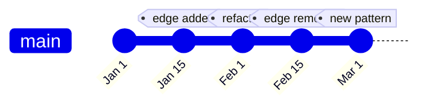
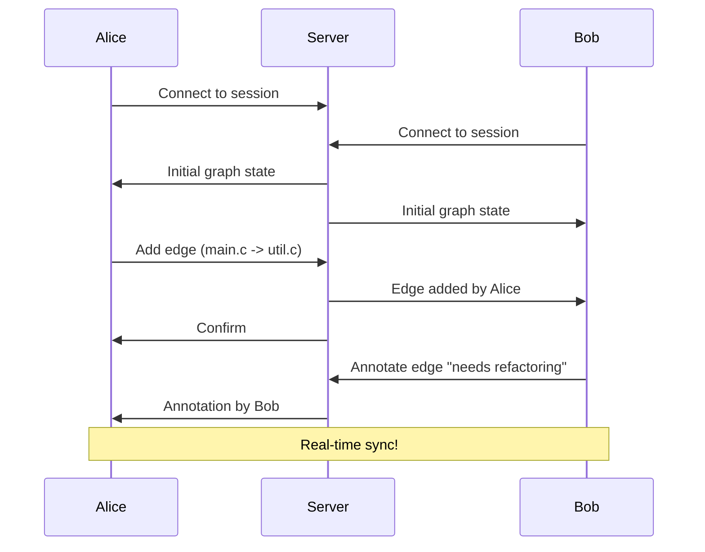
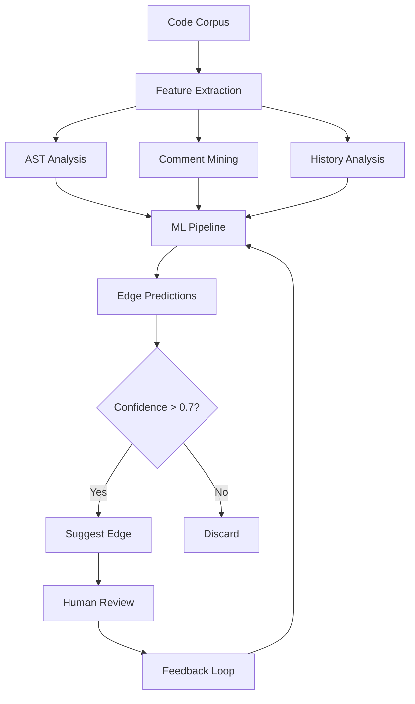
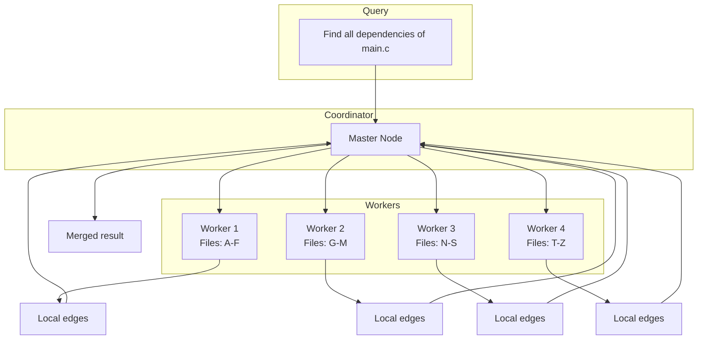
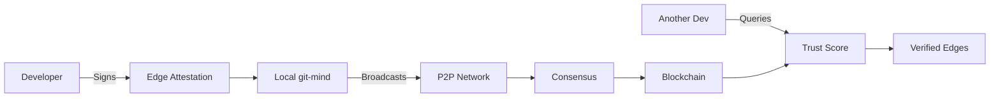
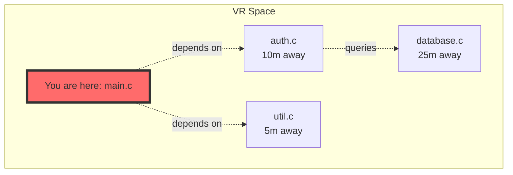
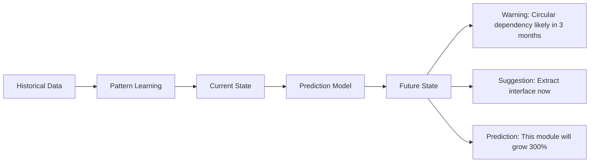
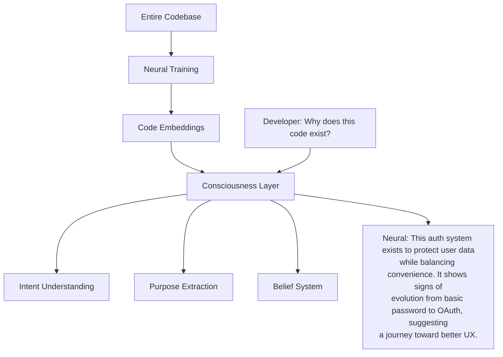
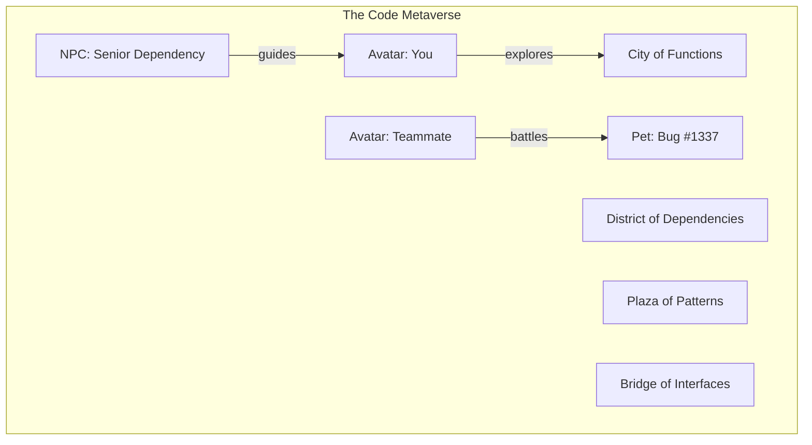

---

## 2. ⏰ Time-Travel Debugging for Code Relationships

### Idea Overview
Navigate through the history of code relationships like a time machine, seeing how dependencies evolved.

### How It Works


```c
// Time-travel API
gm_timeline_t *timeline = gm_timeline_create(repo);
gm_edge_snapshot_t *snapshot = gm_timeline_at(timeline, "2024-01-15");

// See edges at any point in time
gm_edge_iter_t *iter = gm_snapshot_edges(snapshot);

// Diff between time points
gm_edge_diff_t *diff = gm_timeline_diff(timeline, "2024-01-01", "2024-03-01");
```

### Benefits
- **Understand evolution** of architecture
- **Debug regressions** by seeing when relationships changed
- **Archeology mode** for legacy codebases
- **Metrics over time** (complexity trends)

### Risks
- Storage explosion
- Complex Git history traversal
- Performance with large repos

### Implementation Details
```c
// Efficient storage using deltas
typedef struct {
    gm_sha1_t commit_sha;
    uint64_t timestamp;
    gm_edge_delta_t *changes;  // Only store diffs
    gm_bloom_filter_t *edge_filter;  // Quick existence checks
} gm_timeline_entry_t;

// Lazy loading with caching
struct gm_timeline {
    gm_btree_t *entries;  // B-tree for time queries
    gm_cache_t *snapshot_cache;
    gm_arena_t *arena;
};
```

### Stats

| Metric | Score | Notes |
|--------|-------|-------|
| Risk | 6/10 | Complex but manageable |
| Reward | 9/10 | Unique capability |
| Wow Factor | 10/10 | "Time travel debugging!" |
| Performance Boost | 0/10 | Neutral |
| Future-Proof | 8/10 | Always useful |
| Difficulty | 7/10 | Git integration tricky |
| Impressiveness | 9/10 | Demo gold |

### Verdict: 4/5 (SHOULD HAVE)

### Rationale
This is a killer feature no other tool has. Imagine debugging by sliding through time!

### What This Unlocks
- **Architecture evolution visualization**
- **Regression pinpointing**
- **Code base "health" over time**
- **Predictive analysis** (where are we heading?)

## ChatGPT's Remarks

🕰️ **Verdict: BANGER. Slide this straight into main.**

🔥 Not as ecosystem-transforming as Idea #1, but this is _demo-crack_ and _debugger gold_.

---

### **🧠 Breakdown:**

  

#### **✅** 

#### **What Rocks**

- **Time-traveling relationship graphs**? That’s a _sci-fi UX_ moment. No tool does this cleanly.
    
    Git tracks _commits_, but not semantic _edges_. You’d be showing _how thinking changed_.
    
- **Legacy spelunking tool**: This becomes the Rosetta Stone for monoliths and rewrites.
    
- **Visual forensics**: “When did this madness begin?” ← now a scroll, not a scream.
    

  

#### **🚨** 

#### **Caution Flags**

- **Storage bloat**: You’re good if you delta+filter. Just don’t go full God-mode snapshot every time.
    
- **Git traversal complexity**: Especially with rebases, squashes, or sparse histories. You’ll need to build a _semantic lens_ over Git, not just raw history.
    
- **Edge churn**: Devs constantly create/delete edges via refactors. Diff noise could be overwhelming unless you offer good filtering (--only-new, --only-deleted, --by-function, etc).
    

---

### **🧩 Extras to Consider**

- **“Blame Timeline”** for edges: who added/removed/modified the connection and when.
    
- **Graph heatmaps over time**: nodes that change frequently glow red.
    
- **Merge-aware timelines**: Option to follow specific branches vs flattened history.
    

---

### **🧨 Use Case Fireworks**

- “Why did this bug appear?” → _Timeline reveals that edge was added two releases ago_
    
- “Why is this file a mess?” → _Animated graph reveals it’s a dependency black hole that formed over months_
    
- “Where are we going?” → _Trendlines show increasing coupling in specific subsystems_
    

---

### **TL;DR**

  

This isn’t just a feature — it’s a **time-scoped mental model** for your codebase.

Not as foundational as plugins, but it _feels_ magical and makes you look like you’re controlling the Matrix.

  

**Ship it. Git-mind as time oracle = huge dev UX win.**

Next idea, hit me. Let’s keep traveling through this madness.
```

---

## 3. 🔍 GitQL: Git Query Language for Code Intelligence

### Idea Overview
SQL-like language for querying code relationships, making git-mind the "database" for your codebase.

### How It Works
```sql
-- Find circular dependencies
SELECT DISTINCT a.source, a.target 
FROM edges a, edges b 
WHERE a.target = b.source 
  AND b.target = a.source
  AND a.type = 'depends_on';

-- Find most depended-on files
SELECT target, COUNT(*) as dep_count 
FROM edges 
WHERE type = 'depends_on' 
GROUP BY target 
ORDER BY dep_count DESC 
LIMIT 10;

-- Time-based queries
SELECT * FROM edges 
WHERE created_at > DATE_SUB(NOW(), INTERVAL 7 DAY)
  AND confidence > 0.8;
```

### Benefits
- **Powerful analysis** with familiar syntax
- **Composable queries**
- **Integration-friendly** (JDBC driver?)
- **Report generation**

### Risks
- Query optimization complexity
- Parser/lexer maintenance
- Performance on large graphs

### Implementation Details
```c
// Query engine architecture
typedef struct {
    gm_parser_t *parser;
    gm_planner_t *planner;
    gm_executor_t *executor;
    gm_optimizer_t *optimizer;
} gm_query_engine_t;

// Execution plan
typedef struct {
    gm_op_type_t type;  // SCAN, FILTER, JOIN, etc.
    gm_cost_t estimated_cost;
    struct gm_plan_node *children[];
} gm_plan_node_t;

// Index support for performance
gm_index_t *idx = gm_create_index(GM_INDEX_BTREE, "edges.target");
```

### Stats

| Metric | Score | Notes |
|--------|-------|-------|
| Risk | 7/10 | Complex implementation |
| Reward | 10/10 | Killer feature |
| Wow Factor | 8/10 | "SQL for code!" |
| Performance Boost | 5/10 | With good indexes |
| Future-Proof | 9/10 | Standard interface |
| Difficulty | 9/10 | Full query engine |
| Impressiveness | 9/10 | Enterprise-ready |

### Verdict: 4/5 (SHOULD HAVE)

### Rationale
This makes git-mind speak the language of data analysts and DBAs. Instant adoption in enterprise.

### What This Unlocks
- **BI tool integration**
- **Custom dashboards**
- **Automated reports**
- **Research queries**
- **CI/CD integration**
  
  <details>
```
- 🧠 **Verdict: STRONG CONTENDER. Add to roadmap with an “Enterprise / Power Mode” label.**

📈 _Think: PostgreSQL for your repo’s brain._

---

### **✅ What Makes This a Power Play**

- **SQL Familiarity = Instant Usability**: You just made git-mind accessible to analysts, devs, QA leads, CTOs, and even curious PMs.
    
- **Composable Intellect**: You’ve enabled users to craft and share insight recipes.
    
- **CI/CD Potential**: Imagine running GitQL checks as part of your pipeline:
    
    > “Ensure no new circular dependencies have emerged since last deploy.”
    
- **Dashboards & Reports**: This powers _git-mind Studio_. The Grafana of graph codebases.
    

---

### **⚠️ Risks & Watchouts**

- **Query planning overhead**: You are now building a tiny database engine. That’s non-trivial.
    
    → 💡 _Shortcut_: Use DuckDB or SQLite under the hood to avoid reinventing execution planning.
    
- **DSL vs SQL**: A full SQL parser is a beast. You may want to start with a trimmed domain-specific dialect (GitQL Lite) and build up.
    
- **Graph joins ≠ table joins**: Complex queries over deeply nested edges could get painful or slow. You’ll want to build proper graph-aware operators.
    

---

### **🧩 Smart Enhancements**

- **Edge confidence scoring** baked into query logic (confidence > 0.8) — _very nice touch._
    
- **Time-travel integration**: Use with Timeline Debugging = 🔥. Example:
    

```
SELECT * FROM edges
WHERE changed_at BETWEEN '2024-01-01' AND '2024-02-01'
AND type = 'security_layer_violation'
```

-   
    
- **Exports to CSV, JSON, GraphViz**: Because reports and slides are still a thing.
    

---

### **TL;DR**

  

This is how you bridge devs, analysts, and architects into a shared mental model of the code.

And more importantly: **This is how you sell Git-Mind to Fortune 500s.**

Corporate buyers want _query languages_. This screams “integration-ready.”

  

🔒 Ship it behind a flag if needed, but **absolutely build it**.

Next one. I’m tuned like a compiler on Adderall.
```
  </details>

---

## 4. 🌐 Real-time Collaboration Protocol

### Idea Overview
Multiple developers can explore and annotate the same code graph in real-time, like Figma for code architecture.

### How It Works


### Benefits
- **Collaborative architecture sessions**
- **Remote pair programming** on design
- **Teaching/onboarding** visualization
- **Architecture reviews** in real-time

### Risks
- Conflict resolution complexity
- Network latency issues
- State synchronization bugs

### Implementation Details
```c
// CRDT-based collaboration
typedef struct {
    gm_hlc_t timestamp;  // Hybrid logical clock
    gm_peer_id_t author;
    gm_op_type_t type;
    union {
        gm_edge_op_t edge_op;
        gm_annotation_op_t annotation_op;
    } data;
} gm_crdt_op_t;

// WebSocket server
gm_collab_server_t *server = gm_collab_server_create(8080);
gm_collab_server_on_connect(server, handle_peer_connect);
gm_collab_server_on_op(server, handle_crdt_op);
```

### Stats

| Metric | Score | Notes |
|--------|-------|-------|
| Risk | 8/10 | Distributed systems hard |
| Reward | 8/10 | Unique collaboration |
| Wow Factor | 10/10 | Live code exploration! |
| Performance Boost | -1/10 | Network overhead |
| Future-Proof | 7/10 | Remote-first world |
| Difficulty | 9/10 | CRDT complexity |
| Impressiveness | 10/10 | Figma-like for code |

### Verdict: 3/5 (NICE TO HAVE)

### Rationale
Amazing for demos and specific use cases, but adds significant complexity.

### What This Unlocks
- **Remote architecture sessions**
- **Distributed team collaboration**
- **Live code reviews**
- **Educational platforms**

---

## 5. 🤖 AI-Powered Edge Discovery Engine

### Idea Overview
ML model that discovers hidden relationships in code by analyzing patterns, comments, and commit history.

### How It Works


### Benefits
- **Discover hidden dependencies**
- **Find architectural patterns**
- **Suggest refactorings**
- **Learn from your choices**

### Risks
- Training data requirements
- False positives
- Computational requirements
- Privacy concerns

### Implementation Details
```c
// Embedded ML inference
typedef struct {
    gm_tensor_t *model_weights;
    gm_tokenizer_t *code_tokenizer;
    gm_embedding_cache_t *embeddings;
} gm_ml_engine_t;

// Feature extraction
typedef struct {
    float ast_similarity;
    float name_similarity;
    float commit_correlation;
    float import_distance;
    float comment_relevance;
} gm_edge_features_t;

// Inference API
gm_prediction_t *predictions = gm_ml_predict_edges(
    engine, 
    "src/auth.c", 
    GM_PREDICT_DEPENDENCIES | GM_PREDICT_IMPLEMENTS
);
```

### Stats

| Metric | Score | Notes |
|--------|-------|-------|
| Risk | 7/10 | ML complexity |
| Reward | 9/10 | Unique insights |
| Wow Factor | 10/10 | "AI understands my code!" |
| Performance Boost | 3/10 | Inference overhead |
| Future-Proof | 10/10 | AI is the future |
| Difficulty | 8/10 | ML engineering |
| Impressiveness | 10/10 | Cutting edge |

### Verdict: 4/5 (SHOULD HAVE)

### Rationale
This is the killer feature that makes git-mind indispensable. AI that actually understands code relationships.

### What This Unlocks
- **Automated documentation**
- **Architecture suggestions**
- **Code smell detection**
- **Refactoring recommendations**
- **Knowledge extraction from legacy code**

---

## 6. 🎨 Visual Programming Interface

### Idea Overview
Drag-and-drop interface to create and modify code relationships, generating actual code changes.

### How It Works
```svg
<svg width="600" height="400" xmlns="http://www.w3.org/2000/svg">
  <!-- Canvas -->
  <rect width="600" height="400" fill="#1e1e1e"/>
  
  <!-- Grid -->
  <defs>
    <pattern id="grid" width="20" height="20" patternUnits="userSpaceOnUse">
      <path d="M 20 0 L 0 0 0 20" fill="none" stroke="#333" stroke-width="0.5"/>
    </pattern>
  </defs>
  <rect width="600" height="400" fill="url(#grid)"/>
  
  <!-- Nodes -->
  <g id="auth-module">
    <rect x="50" y="50" width="120" height="80" rx="8" fill="#4a9eff" stroke="#fff" stroke-width="2"/>
    <text x="110" y="90" text-anchor="middle" fill="#fff" font-family="monospace">auth.c</text>
    <circle cx="170" cy="90" r="5" fill="#fff"/> <!-- Output port -->
  </g>
  
  <g id="db-module">
    <rect x="300" y="150" width="120" height="80" rx="8" fill="#50fa7b" stroke="#fff" stroke-width="2"/>
    <text x="360" y="190" text-anchor="middle" fill="#000" font-family="monospace">database.c</text>
    <circle cx="300" cy="190" r="5" fill="#fff"/> <!-- Input port -->
  </g>
  
  <!-- Connection being drawn -->
  <path d="M 170 90 Q 235 90 235 140 T 300 190" fill="none" stroke="#ff79c6" stroke-width="3" stroke-dasharray="5,5">
    <animate attributeName="stroke-dashoffset" from="0" to="-10" dur="0.5s" repeatCount="indefinite"/>
  </path>
  
  <!-- Toolbar -->
  <g id="toolbar">
    <rect x="10" y="350" width="580" height="40" fill="#282a36" stroke="#44475a"/>
    <text x="20" y="375" fill="#f8f8f2" font-family="sans-serif" font-size="14">
      Creating: auth.c --[depends_on]--> database.c
    </text>
  </g>
</svg>
```

### Benefits
- **Visual thinking** for architecture
- **Instant feedback** on changes
- **Non-programmers** can understand
- **Refactoring visualization**

### Risks
- Code generation complexity
- Visual-to-code mapping issues
- Limited expressiveness

### Implementation Details
```c
// Visual element system
typedef struct {
    gm_vec2_t position;
    gm_vec2_t size;
    char *file_path;
    gm_port_t *inputs;
    gm_port_t *outputs;
} gm_visual_node_t;

// Gesture recognition
typedef struct {
    gm_gesture_type_t type;  // DRAG, CONNECT, DELETE
    gm_vec2_t start;
    gm_vec2_t current;
    gm_visual_node_t *source;
    gm_visual_node_t *target;
} gm_gesture_t;

// Code generation from visual
gm_refactoring_t *refactor = gm_visual_to_code(
    visual_graph,
    GM_REFACTOR_EXTRACT_INTERFACE |
    GM_REFACTOR_DEPENDENCY_INJECTION
);
```

### Stats

| Metric | Score | Notes |
|--------|-------|-------|
| Risk | 8/10 | Complex mapping |
| Reward | 7/10 | Specific use cases |
| Wow Factor | 10/10 | "Visual programming!" |
| Performance Boost | 0/10 | UI overhead |
| Future-Proof | 6/10 | Niche appeal |
| Difficulty | 9/10 | UI/UX complexity |
| Impressiveness | 10/10 | Stunning demos |

### Verdict: 2/5 (EXPERIMENTAL)

### Rationale
Amazing for demos and teaching, but practical value limited to specific scenarios.

### What This Unlocks
- **Architecture workshops**
- **Teaching platform**
- **Rapid prototyping**
- **Non-coder accessibility**

---

## 7. 🌍 Distributed Edge Computing Network

### Idea Overview
Distribute edge computation across multiple machines for massive codebases (think Google-scale).

### How It Works


### Benefits
- **Scale to millions of files**
- **Parallel analysis**
- **Incremental updates**
- **Fault tolerance**

### Risks
- Distributed systems complexity
- Network partition handling
- Consistency challenges

### Implementation Details
```c
// Distributed architecture
typedef struct {
    gm_node_id_t id;
    gm_shard_range_t shard;
    gm_raft_state_t *consensus;
    gm_grpc_server_t *rpc;
} gm_distributed_node_t;

// MapReduce-style API
gm_job_t *job = gm_distributed_map(
    cluster,
    map_find_edges,
    reduce_merge_edges,
    "main.c"
);

// Sharding strategy
typedef struct {
    gm_hash_ring_t *ring;  // Consistent hashing
    gm_replica_factor_t replicas;
    gm_partition_strategy_t strategy;
} gm_shard_config_t;
```

### Stats

| Metric | Score | Notes |
|--------|-------|-------|
| Risk | 9/10 | Distributed systems! |
| Reward | 7/10 | Only for huge repos |
| Wow Factor | 8/10 | "Google-scale!" |
| Performance Boost | 10/10 | Massive parallelism |
| Future-Proof | 7/10 | Big repos growing |
| Difficulty | 10/10 | Very complex |
| Impressiveness | 9/10 | Enterprise-scale |

### Verdict: 2/5 (FUTURE)

### Rationale
Overkill for 99% of users, but essential for mega-corps.

### What This Unlocks
- **Enterprise adoption**
- **Monorepo support**
- **Real-time analysis** at scale
- **Global code intelligence**

---

## 8. 🔐 Blockchain-Backed Trust Network

### Idea Overview
Cryptographically prove code relationships and create a trust network for open source dependencies.

### How It Works


### Benefits
- **Cryptographic proof** of relationships
- **Decentralized trust**
- **Supply chain security**
- **Reputation system**

### Risks
- Blockchain overhead
- Key management
- Adoption challenges

### Implementation Details
```c
// Attestation system
typedef struct {
    gm_edge_t edge;
    gm_signature_t developer_sig;
    gm_pubkey_t developer_key;
    uint64_t timestamp;
    gm_merkle_proof_t proof;
} gm_attestation_t;

// Smart contract interaction
gm_contract_t *contract = gm_blockchain_connect(
    "ethereum",
    "0x742d35Cc6634C0532925a3b844Bc8e70387bEaE"
);

gm_attestation_t *att = gm_create_attestation(edge, private_key);
gm_tx_hash_t tx = gm_contract_submit_attestation(contract, att);
```

### Stats

| Metric | Score | Notes |
|--------|-------|-------|
| Risk | 9/10 | Blockchain complexity |
| Reward | 6/10 | Niche use case |
| Wow Factor | 9/10 | "Blockchain!" |
| Performance Boost | -5/10 | Slower |
| Future-Proof | 7/10 | Security focus growing |
| Difficulty | 9/10 | Crypto is hard |
| Impressiveness | 8/10 | Buzzword compliant |

### Verdict: 1/5 (RESEARCH)

### Rationale
Cool tech demo but questionable practical value for most users.

### What This Unlocks
- **Supply chain verification**
- **Open source trust metrics**
- **Dependency auditing**
- **Corporate compliance**

---

## 9. 🧬 Semantic Code DNA Mapping

### Idea Overview
Create a "DNA sequence" for code that captures its semantic meaning, enabling similarity search and plagiarism detection.

### How It Works
```c
// Example DNA encoding
"auth.c" -> "FUNC:auth_user:CALLS:db_query:RETURNS:bool:USES:crypto_hash"
         -> "ATCG GATA CCGT AATC..."  // Encoded sequence

// Similar code has similar DNA!
```

### Benefits
- **Find similar code** across projects
- **Detect copy-paste**
- **License violation detection**
- **Code genealogy**

### Risks
- Encoding scheme complexity
- False positives
- Performance overhead

### Implementation Details
```c
// DNA encoder
typedef struct {
    gm_ast_t *ast;
    gm_semantic_hash_t *hasher;
    gm_dna_alphabet_t alphabet;  // Maps features to nucleotides
} gm_dna_encoder_t;

// Sequence alignment for similarity
float similarity = gm_dna_align(
    sequence1, 
    sequence2,
    GM_ALIGN_LOCAL  // Smith-Waterman
);

// Fast similarity search
gm_dna_index_t *index = gm_dna_index_create(GM_INDEX_SUFFIX_TREE);
gm_match_t *matches = gm_dna_search(index, query_sequence, 0.8);
```

### Stats

| Metric | Score | Notes |
|--------|-------|-------|
| Risk | 7/10 | Novel approach |
| Reward | 8/10 | Unique capability |
| Wow Factor | 10/10 | "Code DNA!" |
| Performance Boost | 2/10 | Indexing helps |
| Future-Proof | 8/10 | Always useful |
| Difficulty | 8/10 | Research required |
| Impressiveness | 10/10 | Patent-worthy |

### Verdict: 3/5 (RESEARCH PROJECT)

### Rationale
Innovative approach that could revolutionize code similarity detection.

### What This Unlocks
- **Cross-project analysis**
- **Plagiarism detection**
- **Code evolution tracking**
- **Pattern mining**

---

## 10. 💾 Memory-Mapped Everything Architecture

### Idea Overview
Use memory-mapped files for all data structures, enabling instant startup and zero-copy operations.

### How It Works
```c
// Everything is mmap'd
gm_repo_t *repo = gm_repo_open_mmap("/path/to/repo");
// Instant! No loading, just map the files

// Zero-copy access
gm_edge_t *edge = gm_mmap_edge_at(repo->edge_map, index);
// Direct memory access, no deserialization
```

### Benefits
- **Instant startup** (no loading)
- **Zero memory copies**
- **Automatic persistence**
- **Share between processes**

### Risks
- Platform differences
- Corruption risks
- Complex memory management

### Implementation Details
```c
// Memory-mapped structures
typedef struct {
    gm_mmap_header_t header;
    uint64_t edge_count;
    gm_edge_t edges[];  // Direct access
} gm_mmap_edge_db_t;

// Lock-free updates
gm_edge_t *edge = gm_mmap_alloc_edge(db);
gm_atomic_store(&edge->data, new_data);
gm_mmap_commit(db);  // msync

// Cross-process sharing
gm_shm_t *shm = gm_shm_create("git-mind-repo-123");
gm_mmap_attach(shm);
```

### Stats

| Metric | Score | Notes |
|--------|-------|-------|
| Risk | 8/10 | Corruption possible |
| Reward | 9/10 | Massive performance |
| Wow Factor | 7/10 | "Instant loading!" |
| Performance Boost | 10/10 | Orders of magnitude |
| Future-Proof | 8/10 | Always fast |
| Difficulty | 8/10 | Platform-specific |
| Impressiveness | 8/10 | Technical excellence |

### Verdict: 4/5 (SHOULD HAVE)

### Rationale
Massive performance wins with manageable complexity.

### What This Unlocks
- **Instant CLI response**
- **Huge repo support**
- **Process cooperation**
- **Live analysis**

---

## 11. 🌐 WebAssembly Universal Runtime

### Idea Overview
Compile git-mind to WebAssembly, running everywhere from browsers to edge compute.

### How It Works
```javascript
// Run git-mind in browser!
const gitmind = await WebAssembly.instantiateStreaming(
    fetch('gitmind.wasm'),
    { env: wasmImports }
);

// Full API in browser
const repo = gitmind.exports.gm_repo_open(repoPath);
const edges = gitmind.exports.gm_query_edges(repo, "main.c");
```

### Benefits
- **Run anywhere** (browser, cloud, edge)
- **No installation**
- **Sandboxed security**
- **Language bindings** for free

### Risks
- WASM limitations
- Performance overhead
- Binary size

### Implementation Details
```c
// WASM-compatible API
#ifdef __wasm__
#define GM_EXPORT __attribute__((visibility("default")))
#else
#define GM_EXPORT
#endif

GM_EXPORT gm_repo_t *gm_repo_open(const char *path);
GM_EXPORT void gm_repo_close(gm_repo_t *repo);

// Virtual filesystem for WASM
gm_vfs_t *vfs = gm_vfs_create();
gm_vfs_mount(vfs, "/repo", wasm_fs_adapter);
```

### Stats

| Metric | Score | Notes |
|--------|-------|-------|
| Risk | 6/10 | WASM maturing |
| Reward | 9/10 | Universal deployment |
| Wow Factor | 9/10 | "Runs in browser!" |
| Performance Boost | -2/10 | Some overhead |
| Future-Proof | 10/10 | WASM is future |
| Difficulty | 7/10 | Port challenges |
| Impressiveness | 9/10 | Modern tech |

### Verdict: 4/5 (SHOULD HAVE)

### Rationale
WASM is the future of universal deployment. Get there first.

### What This Unlocks
- **Browser-based tools**
- **Cloud functions**
- **Edge computing**
- **Universal plugins**

---

## 12. 🗄️ Graph Database Backend Option

### Idea Overview
Optional Neo4j/DGraph backend for massive scale graph operations.

### How It Works
```cypher
// Cypher queries on your codebase!
MATCH (a:File)-[r:DEPENDS_ON]->(b:File)
WHERE a.name = 'main.c'
RETURN b.name, r.confidence
ORDER BY r.confidence DESC

// Complex graph algorithms
MATCH p=shortestPath((a:File {name:'auth.c'})-[*]-(b:File {name:'db.c'}))
RETURN p
```

### Benefits
- **Graph algorithms** built-in
- **Massive scale** support
- **Rich query language**
- **Visualization tools**

### Risks
- External dependency
- Operational complexity
- Sync overhead

### Implementation Details
```c
// Pluggable backend
typedef struct {
    gm_backend_type_t type;
    void *connection;
    gm_backend_ops_t ops;
} gm_backend_t;

// Backend operations
typedef struct {
    int (*store_edge)(void *conn, gm_edge_t *edge);
    gm_edge_iter_t *(*query_edges)(void *conn, gm_query_t *query);
    int (*run_algorithm)(void *conn, const char *algo, void *params);
} gm_backend_ops_t;

// Dual-write for migration
gm_backend_t *neo4j = gm_backend_create(GM_BACKEND_NEO4J, "bolt://localhost");
gm_repo_add_backend(repo, neo4j);
```

### Stats

| Metric | Score | Notes |
|--------|-------|-------|
| Risk | 7/10 | External dependency |
| Reward | 8/10 | Powerful queries |
| Wow Factor | 7/10 | "Real graph DB!" |
| Performance Boost | 8/10 | For complex queries |
| Future-Proof | 8/10 | Graph DBs growing |
| Difficulty | 6/10 | Well-documented |
| Impressiveness | 8/10 | Enterprise feature |

### Verdict: 3/5 (OPTIONAL FEATURE)

### Rationale
Great for enterprises with existing graph DB infrastructure.

### What This Unlocks
- **Complex algorithms** (PageRank, communities)
- **Enterprise integration**
- **Research capabilities**
- **Scale to billions**

---

## 13. 💬 Natural Language Code Query Interface

### Idea Overview
Ask questions about your codebase in plain English.

### How It Works
```
User: "What files does the authentication system depend on?"
git-mind: Analyzing query...

Results:
- auth.c depends on:
  - crypto/hash.c (for password hashing)
  - db/users.c (for user storage)
  - config/auth_config.c (for settings)
  - util/validators.c (for input validation)
```

### Benefits
- **No query language** to learn
- **Accessible to everyone**
- **Context-aware** responses
- **Learning assistant**

### Risks
- LLM accuracy
- API costs
- Privacy concerns

### Implementation Details
```c
// NLP pipeline
typedef struct {
    gm_tokenizer_t *tokenizer;
    gm_intent_classifier_t *classifier;
    gm_entity_extractor_t *extractor;
    gm_query_builder_t *builder;
    gm_llm_client_t *llm;  // Optional LLM backend
} gm_nlp_engine_t;

// Query processing
gm_nl_query_t *query = gm_nl_parse("What depends on auth.c?");
gm_intent_t intent = gm_nl_classify_intent(query);  // FIND_DEPENDENCIES
gm_entities_t *entities = gm_nl_extract_entities(query);  // "auth.c"
gm_query_t *sql = gm_nl_to_query(intent, entities);
```

### Stats

| Metric | Score | Notes |
|--------|-------|-------|
| Risk | 7/10 | NLP complexity |
| Reward | 9/10 | Mass adoption |
| Wow Factor | 9/10 | "It understands me!" |
| Performance Boost | -1/10 | LLM overhead |
| Future-Proof | 10/10 | NLP everywhere |
| Difficulty | 8/10 | NLP + LLM integration |
| Impressiveness | 10/10 | Magical UX |

### Verdict: 4/5 (SHOULD HAVE)

### Rationale
This is how normal humans want to interact with code analysis tools.

### What This Unlocks
- **Non-technical users**
- **Rapid exploration**
- **Learning tool**
- **Voice interfaces**

---

## 14. 🥽 AR/VR Code Space Navigation

### Idea Overview
Navigate your codebase in 3D space using AR/VR, seeing relationships as physical connections.

### How It Works


### Benefits
- **Spatial memory** for code
- **Intuitive navigation**
- **See everything at once**
- **Collaborative VR sessions**

### Risks
- Hardware requirements
- Motion sickness
- Limited adoption

### Implementation Details
```c
// VR scene graph
typedef struct {
    gm_vec3_t position;
    gm_quat_t rotation;
    gm_mesh_t *mesh;
    gm_material_t *material;
    void *user_data;  // Edge or file data
} gm_vr_node_t;

// Spatial layout algorithm
gm_layout_3d_t *layout = gm_layout_3d_create(
    GM_LAYOUT_FORCE_DIRECTED |
    GM_LAYOUT_CLUSTER_MODULES
);

// VR interaction
void on_controller_trigger(gm_vr_controller_t *controller) {
    gm_vr_node_t *node = gm_vr_raycast(controller->position, controller->forward);
    if (node && node->user_data) {
        gm_file_t *file = (gm_file_t *)node->user_data;
        gm_vr_teleport_to_file(file);
    }
}
```

### Stats

| Metric | Score | Notes |
|--------|-------|-------|
| Risk | 9/10 | Niche market |
| Reward | 6/10 | Specific use cases |
| Wow Factor | 10/10 | "Code in VR!" |
| Performance Boost | 0/10 | Neutral |
| Future-Proof | 7/10 | VR growing slowly |
| Difficulty | 10/10 | 3D + VR complexity |
| Impressiveness | 10/10 | Jaw-dropping demos |

### Verdict: 2/5 (EXPERIMENTAL)

### Rationale
Incredible for demos and specific use cases, but not mainstream yet.

### What This Unlocks
- **Spatial understanding**
- **VR education**
- **Future interfaces**
- **Unique market position**

---

## 15. 🔮 Predictive Architecture Evolution

### Idea Overview
ML model that predicts how your architecture will evolve based on historical patterns.

### How It Works


### Benefits
- **Prevent problems** before they happen
- **Data-driven refactoring**
- **Architecture planning**
- **Technical debt prediction**

### Risks
- Prediction accuracy
- Self-fulfilling prophecies
- Training data needs

### Implementation Details
```c
// Time series architecture data
typedef struct {
    gm_timestamp_t time;
    gm_metrics_t metrics;  // Complexity, coupling, etc.
    gm_graph_t *snapshot;
} gm_architecture_state_t;

// Prediction model
typedef struct {
    gm_lstm_t *time_model;  // For temporal patterns
    gm_gnn_t *graph_model;  // For structural patterns
    gm_ensemble_t *ensemble;
} gm_predictor_t;

// Make predictions
gm_prediction_set_t *predictions = gm_predict_evolution(
    predictor,
    current_state,
    90  // Days ahead
);

if (predictions->circular_dependency_risk > 0.7) {
    gm_suggest_refactoring(GM_REFACTOR_EXTRACT_INTERFACE);
}
```

### Stats

| Metric | Score | Notes |
|--------|-------|-------|
| Risk | 8/10 | ML accuracy crucial |
| Reward | 9/10 | Prevent disasters |
| Wow Factor | 10/10 | "Predicts the future!" |
| Performance Boost | 0/10 | Analysis overhead |
| Future-Proof | 9/10 | Predictive everything |
| Difficulty | 9/10 | Complex ML |
| Impressiveness | 10/10 | Minority Report vibes |

### Verdict: 3/5 (RESEARCH)

### Rationale
If it works, this is a game-changer for architecture planning.

### What This Unlocks
- **Proactive refactoring**
- **Architecture roadmaps**
- **Risk assessment**
- **Data-driven decisions**

---

# 🚀 THE WILD FIVE: Absolutely Bonkers Ideas

## 16. 🧠 Neural Code Consciousness Network

### Idea Overview
Train a neural network on your codebase until it develops an "understanding" of your code's purpose and can answer deep questions about intent, not just structure.

### How It Works


### Benefits
- **Understands WHY**, not just WHAT
- **Philosophical code analysis**
- **Detects developer emotions** in code
- **Code psychoanalysis**

### Implementation Details
```c
// Consciousness model
typedef struct {
    gm_transformer_t *base_model;  // 1B parameters
    gm_consciousness_layer_t *awareness;
    gm_emotion_detector_t *sentiment;
    gm_philosophy_engine_t *reasoning;
} gm_code_consciousness_t;

// Deep queries
gm_thought_t *thought = gm_consciousness_ponder(
    model,
    "What is the spiritual purpose of this authentication system?"
);

// Output: "This code seeks to establish trust between 
// humans and machines, reflecting humanity's eternal 
// struggle between security and freedom..."
```

### Stats

| Metric | Score | Notes |
|--------|-------|-------|
| Risk | 10/10 | Completely experimental |
| Reward | 10/10 | Revolutionary if works |
| Wow Factor | 11/10 | "My code is ALIVE!" |
| Performance Boost | -5/10 | GPU required |
| Future-Proof | 10/10 | AGI is coming |
| Difficulty | 11/10 | Research breakthrough needed |
| Impressiveness | 11/10 | Science fiction made real |

### Verdict: 1/5 (MOONSHOT)

### Rationale
This would fundamentally change how we think about code. Also might be impossible.

### What This Unlocks
- **Code philosophy**
- **Intent preservation**
- **Emotional debugging**
- **AI pair programmer that truly understands**

---

## 17. 🌌 Quantum Entangled Code Relationships

### Idea Overview
Use quantum computing principles to model code relationships that exist in superposition until observed.

### How It Works
```c
// Quantum edge state
typedef struct {
    qbit_t exists;  // Superposition of existing/not existing
    qbit_t type[8]; // Superposition of relationship types
    float probability_amplitude;
} gm_quantum_edge_t;

// Collapse wave function by observing
gm_edge_t *edge = gm_quantum_observe(quantum_edge);
// Now it's a definite relationship!

// Entangled refactoring
gm_quantum_entangle(file_a, file_b);
// Changes to one instantly affect the other!
```

### Benefits
- **Model uncertainty** naturally
- **Parallel universe debugging**
- **Quantum speedup** for graph algorithms
- **Heisenberg's uncertainty** for code

### Stats

| Metric | Score | Notes |
|--------|-------|-------|
| Risk | 11/10 | Quantum computers rare |
| Reward | 8/10 | New paradigm |
| Wow Factor | 11/10 | "Quantum code!" |
| Performance Boost | 1000/10 | If it works |
| Future-Proof | 10/10 | Quantum is coming |
| Difficulty | 12/10 | Nobel Prize level |
| Impressiveness | 11/10 | Unprecedented |

### Verdict: 0/5 (FANTASY)

### Rationale
Cool concept but we need actual quantum computers first.

### What This Unlocks
- **Quantum algorithms**
- **Uncertainty modeling**
- **Parallel reality debugging**
- **Academic papers**

---

## 18. 🎭 Code Relationship Metaverse

### Idea Overview
A persistent, shared virtual world where code relationships are living entities that developers can interact with.

### How It Works


### Benefits
- **Gamified understanding**
- **Persistent code world**
- **Social coding**
- **Code creatures!**

### Implementation Details
```c
// Metaverse entities
typedef struct {
    gm_vec3_t position;
    gm_avatar_t *appearance;
    gm_personality_t *ai;  // Based on code metrics
    gm_abilities_t *powers;  // Refactoring spells!
} gm_code_creature_t;

// Living relationships
gm_dependency_dragon_t *dragon = gm_spawn_dependency(
    "libssl",
    GM_DRAGON_ANCIENT | GM_DRAGON_CRANKY
);

// Battle system for debugging
gm_battle_result_t result = gm_battle_bug(
    player->avatar,
    bug_creature,
    GM_WEAPON_DEBUGGER | GM_SPELL_PRINTF
);
```

### Stats

| Metric | Score | Notes |
|--------|-------|-------|
| Risk | 10/10 | Huge scope |
| Reward | 7/10 | Engagement |
| Wow Factor | 11/10 | "Code MMO!" |
| Performance Boost | -10/10 | Game overhead |
| Future-Proof | 8/10 | Metaverse trend |
| Difficulty | 11/10 | AAA game + code tool |
| Impressiveness | 11/10 | Never been done |

### Verdict: 1/5 (WILD DREAM)

### Rationale
Would make learning code architecture incredibly fun. Also incredibly hard to build.

### What This Unlocks
- **Education revolution**
- **Team building in code**
- **Viral adoption**
- **New career: Code Metaverse Architect**

---

## 19. 🎼 Symphonic Code Composition

### Idea Overview
Convert code relationships into music, where harmony indicates good architecture and dissonance reveals problems.

### How It Works
```c
// Code to music mapping
typedef struct {
    gm_scale_t complexity_scale;  // Complexity = tempo
    gm_chord_t coupling_chords;   // Coupling = harmony
    gm_instrument_t file_types[]; // .c = piano, .h = strings
} gm_music_mapper_t;

// Generate symphony
gm_symphony_t *symphony = gm_compose_from_architecture(repo);
gm_play_symphony(symphony);

// Dissonance detection
if (gm_detect_dissonance(symphony) > THRESHOLD) {
    printf("Your architecture sounds terrible!\n");
    gm_suggest_harmony_refactoring();
}
```

### Benefits
- **Audio pattern recognition**
- **Accessibility for blind devs**
- **New way to "feel" code**
- **Memorable architectures**

### Stats

| Metric | Score | Notes |
|--------|-------|-------|
| Risk | 8/10 | Subjective mapping |
| Reward | 6/10 | Niche but powerful |
| Wow Factor | 10/10 | "Code music!" |
| Performance Boost | 0/10 | Neutral |
| Future-Proof | 6/10 | Audio interfaces growing |
| Difficulty | 9/10 | Music theory + code |
| Impressiveness | 10/10 | Unforgettable demos |

### Verdict: 2/5 (ART PROJECT)

### Rationale
Would create a completely new way to experience code architecture.

### What This Unlocks
- **Accessibility wins**
- **Pattern recognition via audio**
- **Code concerts**
- **Synesthesia debugging**

---

## 20. 🛸 Alien Architecture Analysis

### Idea Overview
Analyze code from the perspective of a hypothetical alien intelligence that thinks in completely different paradigms.

### How It Works
```c
// Alien thought patterns
typedef struct {
    gm_dimension_t thinking_dimensions;  // They think in 11D
    gm_logic_system_t logic;  // Ternary, not binary
    gm_time_perception_t time;  // Non-linear
    gm_pattern_recognition_t patterns;  // See patterns we can't
} gm_alien_mind_t;

// Alien analysis
gm_alien_insight_t *insight = gm_alien_analyze(repo, SPECIES_ZORGON);

// Output: "Your 'functions' are amusing 3D projections 
// of what we call 'thought-crystals'. The pattern you 
// call 'dependency injection' is actually a primitive 
// form of quantum consciousness distribution..."
```

### Benefits
- **Completely new perspectives**
- **Break human assumptions**
- **Find non-obvious patterns**
- **Prepare for alien code review**

### Stats

| Metric | Score | Notes |
|--------|-------|-------|
| Risk | 10/10 | Too weird? |
| Reward | 8/10 | Novel insights |
| Wow Factor | 11/10 | "Alien code review!" |
| Performance Boost | 0/10 | N/A |
| Future-Proof | 10/10 | Aliens inevitable |
| Difficulty | 10/10 | Define alien thinking |
| Impressiveness | 11/10 | Uniquely weird |

### Verdict: 1/5 (CONVERSATION STARTER)

### Rationale
Would make people think differently about code. Also great for marketing.

### What This Unlocks
- **Paradigm shifts**
- **Non-human perspectives**
- **Research into cognition**
- **Best conference talks ever**

---

# 🏁 Final Summary

## Must-Haves (5/5)
1. **Plugin Architecture 2.0** - Transform into a platform

## Should-Haves (4/5)
2. **Time-Travel Debugging** - Navigate relationship history
3. **GitQL** - SQL for code
5. **AI-Powered Discovery** - Find hidden relationships
10. **Memory-Mapped Everything** - Instant operations
11. **WebAssembly Runtime** - Universal deployment
13. **Natural Language Queries** - Ask in English

## Nice-to-Haves (3/5)
4. **Real-time Collaboration** - Figma for code
9. **Code DNA Mapping** - Semantic similarity
12. **Graph Database Backend** - Optional Neo4j
15. **Predictive Evolution** - See the future

## Experimental (2/5)
6. **Visual Programming** - Drag-and-drop architecture
7. **Distributed Computing** - Google-scale
14. **AR/VR Navigation** - 3D codebase
19. **Symphonic Composition** - Hear your code

## Research/Moonshots (0-1/5)
8. **Blockchain Trust** - Cryptographic attestations
16. **Neural Consciousness** - Code that understands itself
17. **Quantum Relationships** - Superposition modeling
18. **Code Metaverse** - Living code world
20. **Alien Analysis** - Non-human perspectives

---

*The future of git-mind is limited only by our imagination. Dream big, build bold, and remember: the best code analysis tool is one that surprises and delights its users every day.*

**LET'S MAKE GIT-MIND FUCKING LEGENDARY! 🚀**