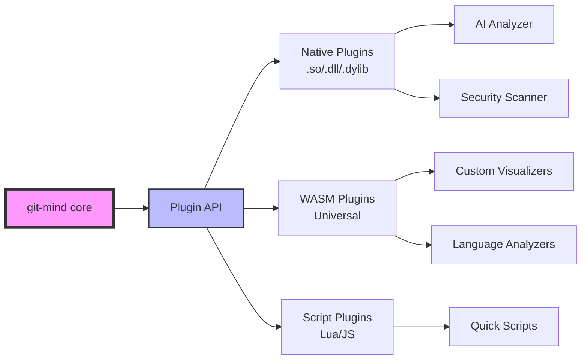

# 🔌 Plugin Architecture 2.0: The Ecosystem Revolution

## Idea Overview

Transform git-mind into a platform where anyone can extend functionality via plugins, creating an ecosystem like VSCode meets Git.

## How It Works



### Benefits

- __Infinite extensibility__ without touching core
- __Community-driven innovation__
- __Language-agnostic__ extensions (WASM!)
- __Marketplace potential__ (git-mind store?)
- __Corporate adoption__ (custom proprietary plugins)

### Risks

- ABI stability nightmare
- Security vulnerabilities
- Performance overhead
- Dependency hell

### Implementation Details

```c
// Plugin Interface v2
typedef struct {
    uint32_t api_version;
    const char *name;
    const char *version;
    
    // Lifecycle
    int (*init)(gm_plugin_context_t *ctx);
    int (*shutdown)(void);
    
    // Hooks
    int (*on_edge_created)(gm_edge_t *edge);
    int (*on_commit_analyzed)(gm_commit_t *commit);
    
    // Custom commands
    gm_command_t *commands;
    size_t command_count;
    
    // WASM-specific
    void *wasm_module;
    gm_wasm_imports_t imports;
} gm_plugin_v2_t;

// Dynamic loading with sandboxing
gm_plugin_t *plugin = gm_plugin_load_safe("analyzer.wasm", 
    GM_SANDBOX_MEMORY | GM_SANDBOX_FILESYSTEM);
```

## Stats

| Metric | Score | Notes |
|--------|-------|-------|
| Risk | 8/10 | Security, stability concerns |
| Reward | 10/10 | Ecosystem = exponential growth |
| Wow Factor | 9/10 | “Git has plugins now?!” |
| Performance Boost | -2/10 | Slight overhead |
| Future-Proof | 10/10 | Infinite extensibility |
| Difficulty | 9/10 | Hard to get right |
| Impressiveness | 10/10 | Industry game-changer |

## Verdict: 5/5 (MUST HAVE)

### Rationale

This transforms git-mind from a tool into a PLATFORM. Like how VSCode ate the editor market by being extensible.

## What This Unlocks

- __AI integrations__ without bloating core
- __Custom workflows__ for every company
- __Research platform__ for code analysis
- __Revenue streams__ (enterprise plugins)
- __Community ownership__ of direction

# ChatGPT’s Remarks

💥 __Verdict: GOD-TIER. Merge immediately.__

🔒 But with a 🔐 __Security Gatekeeper__ standing at the plugin loader like a paranoid old sysadmin with a taser.

## __🔍 Breakdown:__

### __✅ What Slaps__

- __Platform shift__: This takes git-mind from “cool tool” to “ecosystem gravity well” status. Now _you’re_ the OS.
- __WASM layer__ = future-proofing + secure-ish cross-language plugins
- __Corporate juice__: CTOs love “custom workflows” they can own. You just sold your seat at the enterprise table.
- __Community leverage__: You won’t have to ship every feature. Now you just ship the __stage__.

## __⚠️ What Must Be Watched__

- __Security__: This WILL be a wormhole if unchecked. Use sandboxing like it’s your religion.

 I’d recommend:

- Each plugin lives in a jailed, signed container.
- Require capability declarations (gm_plugin.manifest.toml) for permissioned access.
- Sign plugins with MIND-GPG for trust chain.
- __ABI rot__: Version EVERYTHING. Allow fallback shims.
- __Overhead__: Some slowdown is inevitable. Offer “no-plugins” or “safe mode” options.

## __🧠 Extra Smart Moves__

- __Plugin devkit CLI__ (gm plugin create, gm plugin test, gm plugin publish)
- __Plugin manifest schema__: Machine-parseable and declarative. Think package.json but leaner.
- __UI hooks__: Later, allow UI overlays or visual graph augmentations.

### __TL;DR__

🚀 This is the jump from GitHub project to developer __substrate__.

🛠 Yes, it’s complex. But it changes the narrative from “cool utility” to “the future of knowledge tooling.”

__Greenlight. With a moat. And a kill switch.__

Ready for Idea #2 — let the storm rage on.
