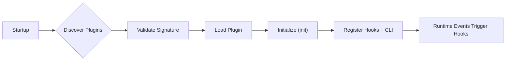

# Technical Design: Plugin Architecture 2.0

## Overview

The plugin system introduces a robust, modular extension layer to Git-Mind, enabling external contributors and internal teams to hook into core graph operations, register commands, and enhance visualization or analysis—all without modifying the core.

---

## Architecture Components

### 1. Plugin Loader (`gm_plugin_load_safe`)

- Loads plugin binaries, scripts, or WASM modules.
- Applies sandbox constraints and capability enforcement.
- Validates digital signatures (MIND-GPG).
- Resolves API version compatibility.

### 2. Plugin Context API (`gm_plugin_context_t`)

- Exposes core APIs to plugins:
  - `gm_query_edges()`, `gm_add_node()`, `gm_log()`, etc.
- Passed to plugins on init.

### 3. Event Hook Dispatcher

- Internally calls all registered `on_*` hooks.
- Parallel-safe, sandbox-aware.
- Events include:
  - `on_edge_created`
  - `on_commit_analyzed`
  - `on_node_accessed`

### 4. Plugin Command Registry

- Dynamically binds CLI commands to plugin implementations.
- Respects declared argument schemas and permission scopes.

---

## Supported Plugin Types

| Type        | Format      | Notes |
|-------------|-------------|-------|
| Native      | `.so`, `.dylib`, `.dll` | High performance, risk of ABI breakage |
| WASM        | `.wasm`     | Cross-platform, sandboxed |
| Scripted    | `.lua`, `.py` | Interpreted, dev-friendly |

---

## Plugin Manifest (TOML)

```toml
# gm_plugin.toml
name = "EdgeLinter"
version = "1.0.0"
entrypoint = "plugin.wasm"
api_version = "2.0"
permissions = ["edges:read", "nodes:write"]
signature = "sig-mindgpg-XYZ123"
```

---

## __Plugin Lifecycle__



---

## __WASM Runtime & Sandboxing__

### __Execution Engine:__

- Uses `Wasmtime` or similar lightweight engine.
- Memory and `syscall` sandboxing enforced.

### __Import API (Exposed to WASM):__

- `gm_read_edge`, `gm_emit_log`, `gm_emit_event`, `gm_get_plugin_config`, etc.

### __Plugin-side:__

- Exports `plugin_init`, `plugin_shutdown`, plus any registered hooks.

---

## __MIND-GPG Signing__

### __Signing Tools:__

- `gm plugin sign` — Signs plugin binaries using dev’s private key.

- `gm plugin verify` — Verifies signature and prints trust level.

### __Signature Metadata:__

- Attached to `gm_plugin.toml` or separate `.sig` file.

- Public keys stored in `~/.gm_trust` or defined via `--trust-key`.

---

## __CLI Toolkit__

|__Command__|__Description__|
|---|---|
|`gm plugin create`|Scaffold a plugin boilerplate|
|`gm plugin build`|Compile and package a plugin|
|`gm plugin sign`|Digitally sign plugin with MIND-GPG|
|`gm plugin verify`|Validate plugin authenticity|
|`gm plugin list`|List installed plugins|
|`gm plugin run <name>`|Execute plugin commands|

---

## __Performance Considerations__

- Native plugins loaded via dynamic linker.
- WASM plugins run in pooled workers.
- Plugin hooks are async-safe, short-circuit if error-prone.
- “Safe Mode” disables all plugins via env flag: `GM_PLUGINS=disabled`.

---

## __Future Extensions__

- UI hooks for graph visual overlays.
- In-graph plugin interaction (plugins add their own nodes!).
- Remote plugin fetching + auto-updates with trust policy.
