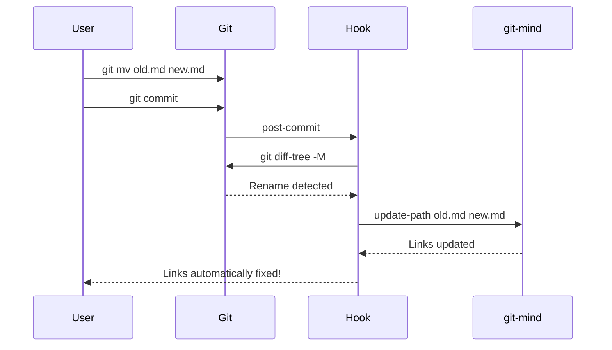

# git-mind Git Hooks

These hooks automatically maintain link consistency when files are renamed, moved, or deleted.

## Installation

```bash
# Install hooks in current repository
./scripts/hooks/install.sh

# Or use git-mind command (future)
git-mind install-hooks
```

## Hooks Included

### post-commit
- Detects file renames and updates links automatically
- Optionally extracts links from markdown files (POC behavior)
- Runs after every commit

### post-merge
- Checks link integrity after merges
- Detects rename conflicts from different branches
- Suggests running `git-mind repair` if needed

### post-checkout
- Verifies links when switching branches
- Warns about broken links in the new branch
- Only runs on branch switches, not file checkouts

## Configuration

### Enable automatic markdown link extraction
```bash
export GITMIND_AUTO_EXTRACT=1
```

This makes git-mind behave like the original POC, automatically creating links from markdown link syntax.

## How It Works

### Rename Detection


### Why post-commit instead of pre-commit?

1. **Simplicity** - No need to stage changes during commit
2. **Safety** - Can't break the commit
3. **Compatibility** - Works with all Git workflows
4. **Performance** - No delay during commit

### Integration with Existing Hooks

The installer will:
1. Back up existing hooks
2. Append git-mind code to existing hooks
3. Or create symlinks if no hooks exist

## Manual Operations

If hooks miss something:

```bash
# Check for broken links
git-mind check

# Fix broken links using Git history
git-mind repair

# Update specific path manually
git-mind update-path old.md new.md
```

## Uninstalling

```bash
./scripts/hooks/uninstall.sh
```

This will restore any backed-up hooks.

## Comparison to POC

The original POC (June 10, 2025) only had:
- Basic post-commit hook
- Markdown link extraction
- No rename detection

These hooks add:
- Automatic rename tracking
- Merge conflict detection  
- Branch switch verification
- Integration with existing hooks

## Future Improvements

1. **pre-receive hook** - Verify link integrity before accepting pushes
2. **commit-msg hook** - Add link changes to commit messages
3. **Performance optimization** - Cache link database for large repos
4. **Cross-repository links** - Handle links between different repos