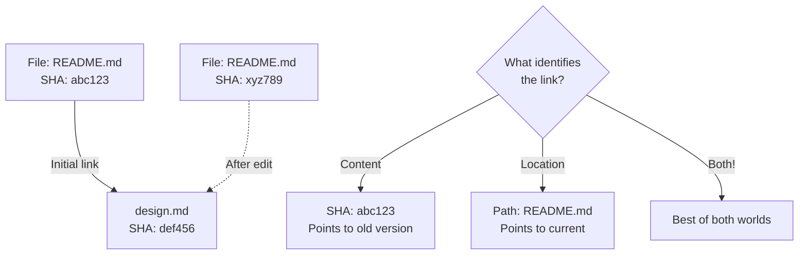
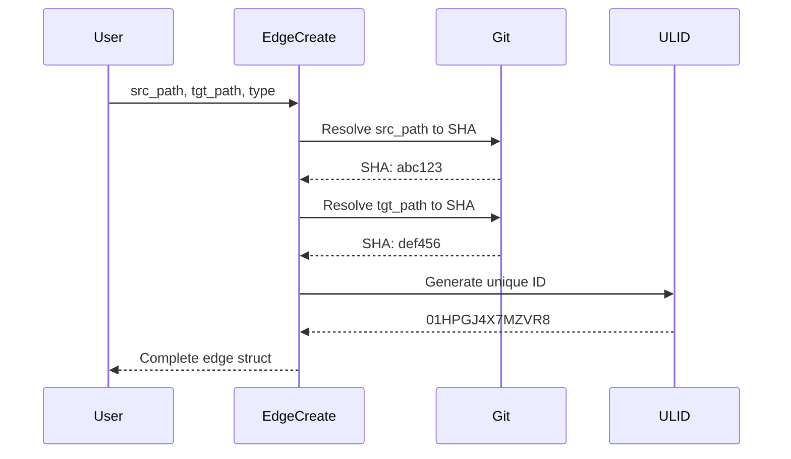

# Edge Management

## Purpose

Create, compare, and format edge structures. The core data type of git-mind.

## Design Rationale

### Edge Structure Design

```c
struct gm_edge {
    uint8_t  src_sha[20];      // Content identity
    uint8_t  tgt_sha[20];      // Content identity
    uint16_t rel_type;         // Semantic relationship
    uint16_t confidence;       // IEEE-754 half
    uint64_t timestamp;        // Unix millis
    char     src_path[256];    // Human context
    char     tgt_path[256];    // Human context
    char     ulid[27];         // Unique ID
};
```

### Why Both SHA and Path



- __SHA__: Immutable content reference
- __Path__: Human-understandable context
- __Both__: Can track evolution over time

### Relationship Types

```c
GM_REL_IMPLEMENTS = 1    // Code implements design
GM_REL_REFERENCES = 2    // Documentation references
GM_REL_DEPENDS_ON = 3    // Functional dependency  
GM_REL_AUGMENTS   = 4    // Updates/extends previous
GM_REL_CUSTOM     = 1000 // User-defined start here
```

Design principle: Start minimal, extend later.

### Confidence as IEEE-754 Half

- 16-bit floating point (half precision)
- Range: 0.0 to 1.0 typical
- Stored as uint16_t for simplicity
- Default: 0x3C00 (1.0)

Why half float?

- Full float (32-bit) wastes space
- Fixed point lacks standards
- Half float has hardware support

## Implementation Details

### Edge Creation Flow



### Path Resolution Strategy

- Use Git index (staged/committed files)
- Working tree changes not seen
- Ensures edges point to committed content
- Fail fast if file not tracked

### ULID Generation

```
01HPGJ4X7M     ZVRASQWRNG
└─timestamp─┘  └─random─┘
```

- Time-sortable
- Globally unique without coordination
- URL-safe encoding
- No collisions in practice

## Edge Cases

### Missing Files

```c
gm_edge_create(ctx, "missing.md", "exists.md", ...)
→ Returns GM_NOT_FOUND
```

- Both files must exist in index
- Clear error, no partial edges

### Path Length Limits

- Max path: 255 characters (+ null)
- Truncated silently if longer
- Git already limits paths similarly

### Unicode Normalization

- No normalization performed
- Git's exact bytes preserved
- Platform differences retained
- Simplicity over correctness

### Zero SHA

```
src_sha = {0,0,0...}
```

- Could mean "deleted file"
- Currently prevented by validation
- Future: Tombstone edges?

## Equality Semantics

```c
int gm_edge_equal(const gm_edge_t *a, const gm_edge_t *b)
```

Edges are equal if:

1. Same source SHA
2. Same target SHA  
3. Same relationship type

NOT compared:

- Timestamp (different creation times)
- Confidence (may be updated)
- Paths (could be renamed)
- ULID (always unique)

This enables deduplication while preserving metadata updates.

## Display Format

```
IMPLEMENTS: src/main.c -> include/api.h
REFERENCES: README.md -> docs/design.md
```

Format rationale:

- Type first (most important)
- Arrow syntax (universal)
- Paths not SHAs (human-readable)
- No timestamp (clutter)

## Performance Characteristics

### Creation Cost

- 2x git_index_get_bypath: ~10μs each
- 1x clock_gettime: ~100ns
- 1x random generation: ~1μs
- Total: ~25μs per edge

### Memory Layout

```
Size: 594 bytes
Alignment: 8 bytes
Cache lines: ~10
```

- Not optimized for cache
- Future: Pack into 64 bytes?

## Security Considerations

### Path Injection

```c
strncpy(edge->src_path, src_path, GM_PATH_MAX - 1);
edge->src_path[GM_PATH_MAX - 1] = '\0';
```

- Always null-terminated
- No buffer overflows
- Path traversal ok (Git handles)

### SHA Verification

- Trust Git's index
- No independent hashing
- Git already verified content

## Testing Strategy

### Essential Tests

1. Create edge with valid files
2. Create edge with missing source
3. Create edge with missing target
4. Path truncation at boundary
5. Unicode paths (emoji test!)
6. Equality comparison matrix

### Property Tests

```c
// Reflexive
assert(gm_edge_equal(&e, &e));

// Symmetric  
if (gm_edge_equal(&a, &b))
    assert(gm_edge_equal(&b, &a));

// Transitive
if (gm_edge_equal(&a, &b) && gm_edge_equal(&b, &c))
    assert(gm_edge_equal(&a, &c));
```

## Future Evolution

### Extended Attributes

```c
struct gm_edge_v2 {
    struct gm_edge base;
    char author[128];
    char reason[512];
    uint32_t flags;
};
```

- Backward compatible
- CBOR handles gracefully
- Add only when needed

### Bidirectional Edges

```
A implements B
implies
B is-implemented-by A
```

- Generate inverse automatically?
- Store once or twice?
- Query layer problem

## Why This Design Satisfies

1. __Minimal__: Only essential fields
2. __Extensible__: CBOR allows growth
3. __Efficient__: Stack-friendly size
4. __Clear__: Each field has one purpose
5. __Git-native__: SHAs are Git's language

As Linus says: "Bad programmers worry about the code. Good programmers worry about data structures."
