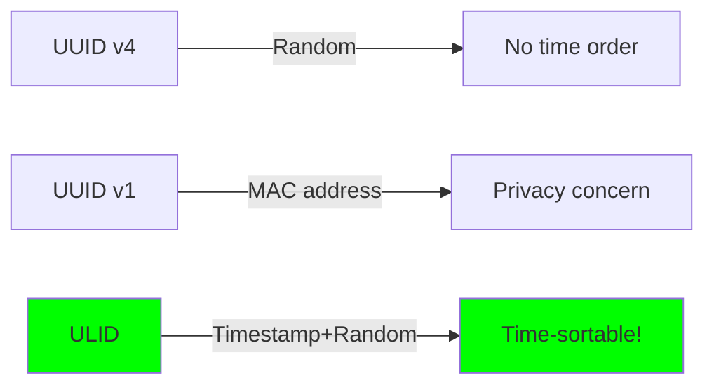

# ULID Generator

## Purpose
Generate Universally Unique Lexicographically Sortable Identifiers for edges.

## Design Rationale

### Why ULID over UUID?


ULIDs give us:
1. **Lexicographic sorting** = chronological order
2. **Millisecond precision** timestamps  
3. **80 bits of randomness** (collision resistant)
4. **Crockford Base32** (human-friendly)
5. **128-bit total** (same as UUID)

### Encoding Choice
```
Crockford's Base32: 0123456789ABCDEFGHJKMNPQRSTVWXYZ

Excluded: I L O U
Why: Look like 1 1 0 U (confusing)
```

Smart design: Reduces human transcription errors.

### Structure Breakdown
```
 01AN4Z07BY      79KA1307SR9X4MV3
|----------|    |----------------|
 Timestamp          Randomness
   48bits             80bits

Total: 128 bits, encoded as 26 characters
```

## Implementation Details

### Time Component
```c
uint64_t time = get_time_millis();
```
- Unix epoch milliseconds
- 48 bits = ~8,900 years until overflow
- Stored big-endian in encoding

### Random Component  
```c
for (int i = 0; i < RANDOM_LEN; i++) {
    out[i] = ENCODING[rand() & 0x1F];
}
```

Current: Uses `rand()` (not cryptographic)
- Good enough for uniqueness
- Not for security tokens
- Future: Read from /dev/urandom?

### Clock Source
```c
clock_gettime(CLOCK_REALTIME, &ts);
```
- POSIX standard
- Millisecond resolution sufficient
- Monotonic not needed (want wall time)

## Edge Cases

### Clock Skew
```
Machine A: 2025-06-16 12:00:00.000 → 01HPGJ4X7M...
Machine B: 2025-06-16 11:59:59.999 → 01HPGJ4X7L...
```
- B's ULID sorts before A's
- Distributed systems problem
- Acceptable for our use case

### Rapid Generation
```c
for (int i = 0; i < 1000000; i++) {
    gm_ulid_generate(ulid);
}
```
- Same millisecond → same timestamp prefix
- 80 bits random → 2^80 space
- Collision probability negligible

### System Time Changes
```
NTP adjustment: Time jumps backward
Result: ULIDs temporarily unsorted
Recovery: Wait 1ms, order restored
```
- Rare in practice
- Git commits have same issue
- Document as known limitation

## Collision Analysis

### Birthday Paradox
With 80 bits of randomness per millisecond:
- 50% collision after 2^40 IDs in same ms
- That's 1.1 trillion IDs in 1ms
- Practically impossible

### Global Uniqueness
Total 128-bit space:
- Same as UUID
- Can generate 1 billion per second for 100 years
- Still only 0.00000006% collision chance

## Performance

### Generation Cost
```
clock_gettime(): ~50ns
16 rand() calls: ~100ns  
Base32 encoding: ~50ns
Total: ~200ns per ULID
```

Can generate 5 million ULIDs/second on modern CPU.

### Memory Footprint
- Stack allocation only
- No heap usage
- 27 bytes output (26 + null)
- ~100 bytes stack frame total

## Security Considerations

### Not Cryptographically Secure
```c
rand() & 0x1F  // Predictable with seed
```
- Don't use for:
  - Session tokens
  - Password reset tokens
  - Anything security-critical
- Fine for:
  - Database IDs
  - Correlation IDs
  - Our edge IDs

### Information Leakage
ULID reveals:
- Creation timestamp (millisecond precision)
- Generation order (sortable)
- Nothing else

Acceptable for git-mind edges.

## Testing Approach

### Unit Tests
1. Format validation (26 chars, valid alphabet)
2. Timestamp extraction and verification
3. Sortability (generate 2, compare)
4. Uniqueness (generate 1M, check duplicates)

### Property Tests
```c
// Monotonic within same millisecond
t1 = generate();
t2 = generate();
assert(strcmp(t1, t2) < 0);

// Length invariant
assert(strlen(ulid) == 26);

// Character set invariant  
assert(strspn(ulid, ENCODING) == 26);
```

### Stress Tests
```bash
# Generate ULIDs at max rate
./ulid-stress --duration=60s --threads=8

# Should see 0 collisions
```

## Future Improvements

### Crypto Random
```c
#ifdef __linux__
    int fd = open("/dev/urandom", O_RDONLY);
    read(fd, random_bytes, 10);
    close(fd);
#else
    arc4random_buf(random_bytes, 10);
#endif
```
- Better randomness quality
- Platform-specific code
- Complexity tradeoff

### Monotonic Random
```
If timestamp_ms == last_timestamp_ms:
    random = last_random + 1
Else:
    random = new_random()
```
- Guarantees strict ordering
- Prevents same-ms collisions
- Adds state (complexity)

## Why This Implementation Rocks

1. **Simple**: ~50 lines of clear code
2. **Fast**: 200ns per generation
3. **Portable**: Pure C99, POSIX time
4. **Sufficient**: Solves our ID needs
5. **Proven**: ULID spec battle-tested

As Linus would say: "Don't overengineer. Make it work, make it right, stop."

## Reference
- [ULID Spec](https://github.com/ulid/spec)
- [Crockford Base32](https://www.crockford.com/base32.html)